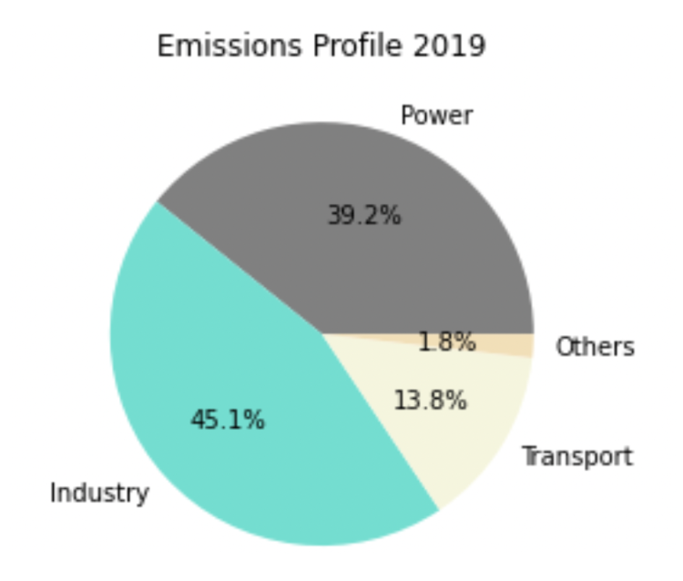
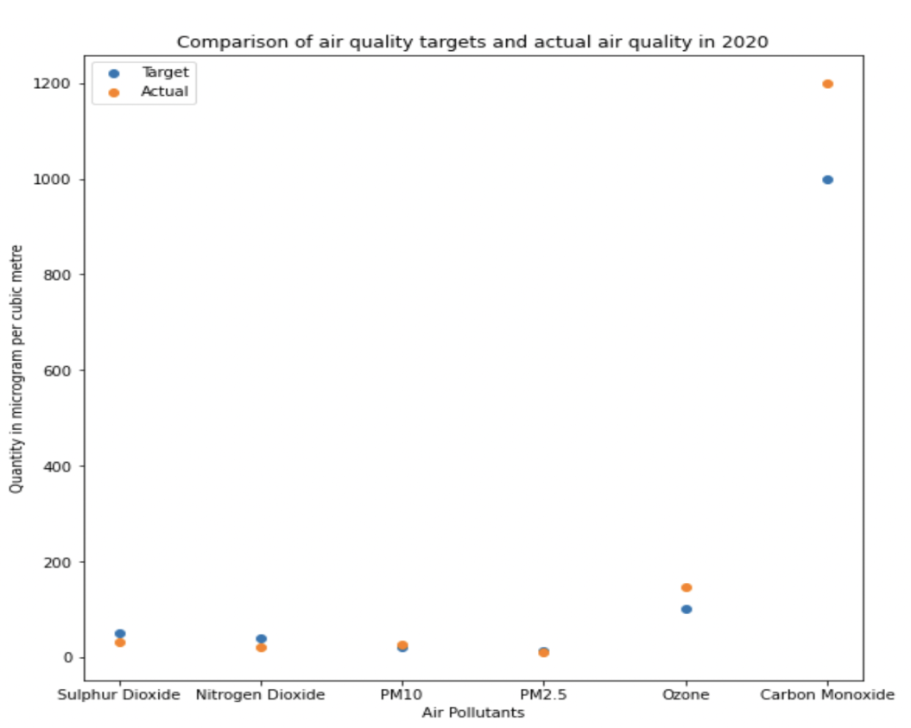
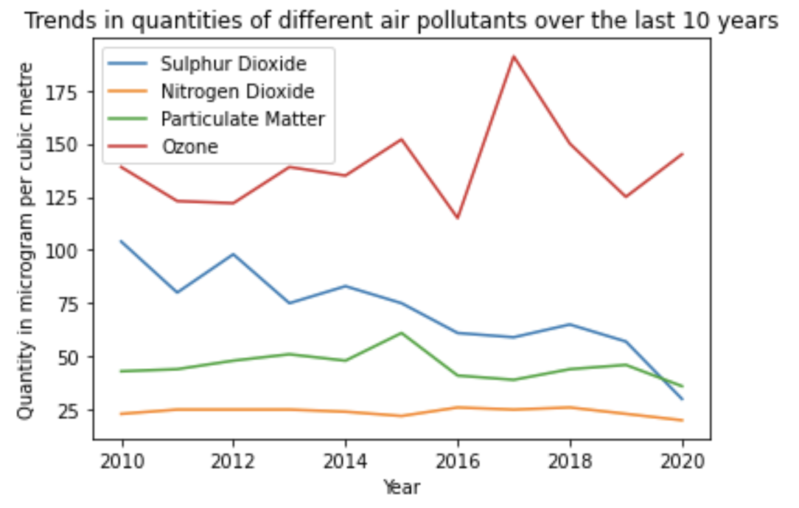
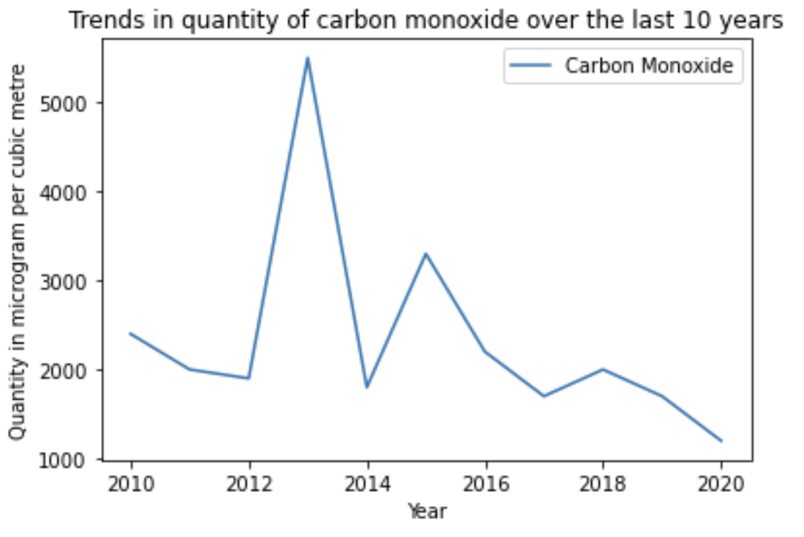

# Household Electricity Usage Calculator & Air Pollution Analysis in Python

This is a Python project that I completed in my first year in university as part of my coursework. The project is split into the following two parts:

## Part 1: Household Electricity Consumption Calculator
The first step towards driving positive behavioural changes for climate action is awareness. The goal of the household electricity consumption calculator is to provide users with insights into their electricity usage, empowering households to make more informed, sustainable decisions through the following features:

**Electricity Consumption Calculation:** Users are prompted to input their household appliances and details such as the estimated daily usage hours for each appliance (with error-checking mechanisms in place). The program then computes and returns the monthly electricity usage and bill.

**Monthly Electricity Consumption and Bill Storage:** The program saves the monthly electricity consumption and bill details to a file, enabling users to review their past electricity consumption records.

**Benchmarking:** Users can select their housing type (e.g., 3-room HDB flat, landed property, etc.). The program then compares the user’s monthly electricity consumption to the average monthly electricity consumption of households of the same housing type, enabling users to assess their energy-efficiency.

**Goal Setting:** Users can set a target consumption level. The program then compares their current and target usage to estimate the potential savings.

**Mini Quiz:** Users can complete a mini quiz that aims to educate users on energy-saving habits.

**FAQ Section:** This feature provides answers to potential questions users may have about using the program.

## Part 2: Analysis of Air Pollution in Singapore
For this part, we utilised the pandas and matplotlib modules in Python to visualise air pollution in Singapore between 2010 - 2020.

**Results**

1. Emissions Profile (2019)

The industrial sector was responsible for nearly half of Singapore's total emissions in 2019, making it the largest contributor to air pollution. In fact, Singapore's industrial emissions are twice the global average. Singapore’s strategic position along the East-West trade route has established it as a critical regional hub for oil storage and refining. Consequently, most emissions from the industrial sector stem from the combustion of fossil fuels in the refining and petrochemical industries, with the latter alone accounting for 75% of the sector's emissions. However, given that Singapore’s industrial sector is heavily concentrated on Jurong Island, there is potential for centralised post-combustion carbon capture and processing, which would help to reduce emissions from the industrial sector.

2. Air Quality Targets vs Actual (2020)

Air quality targets were not met for the following air pollutants: Carbon Monoxide, Ozone, PM10, indicating the need for stricter abatement measures.

3. Trend in Air Pollution in Singapore (2010 - 2020)

Sulfur Dioxide (SO2): There has been a steady decline, largely due to significant government initiatives. These include conducting comprehensive emissions inventories and implementing management strategies, such as mandating the use of cleaner fuels and collaborating with refineries to optimise their processes.

Nitrogen Dioxide (NO2): Emissions have remained relatively stable throughout the observed period.

Particulate Matter (PM): Levels have remained relatively stable, with the exception of a notable spike in 2015 due to a particulary severe transboundary haze event that year.

Ozone (O3): Ozone concentrations have fluctuated erratically between 2010 and 2020, with no clear trend. This is likely due to ozone being a secondary pollutant, meaning it is not emitted directly but forms in the atmosphere through complex chemical reactions involving precursor pollutants such as nitrogen oxides (NOₓ) and volatile organic compounds (VOCs) in the presence of sunlight.

Carbon Monoxide (CO): Overall, there has been a declining trend, though several sharp spikes were observed in 2013, 2015, and 2018, likely due to short-term events such as weather conditions, regional pollution events, or spikes in industrial activity.

## References
Tan, A. (2019, October 7). Parliament: About 75% of industrial emissions are from refining and petrochemicals sector. https://www.straitstimes.com/politics/parliament-about-75-of-industrial-emissions-are-from-refining-and-petrochemicals-sector 

National Environment Agency. (n.d.). Air Pollution. https://www.nea.gov.sg/our-services/pollution-control/air-pollution/air-quality 
